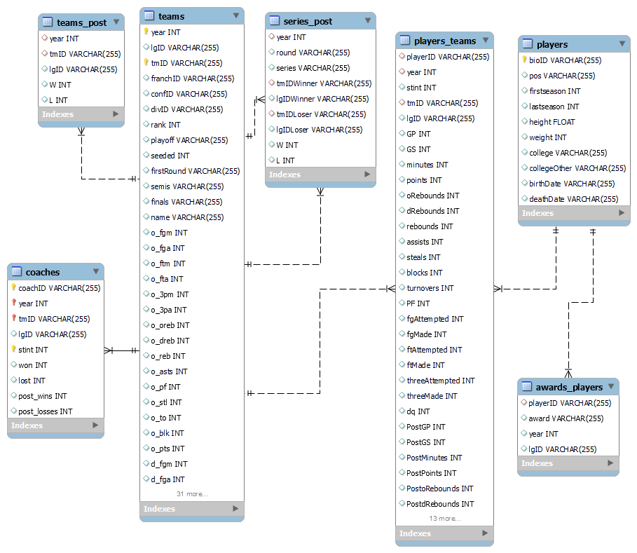

# Machine learning class project - Basketball playoffs

## Members

| Name                    | Email                                                |
| ----------------------- | ---------------------------------------------------- |
| Ilina Kirovska          | [up202301450@edu.fe.up.pt](up202301450@edu.fe.up.pt) |
| Lucas Zulchner Rios | [up202004682@edu.fe.up.pt](up202004682@edu.fe.up.pt) |
| Žan Žlender             | [up202302230@edu.fe.up.pt](up202302230@edu.fe.up.pt) |

## Project

The idea is to predict if a certain team will go to the playoffs this year, based on the results from the years before.

### Task description

> "Basketball tournaments are usually split in two parts. First, all teams play each other aiming to achieve the greatest number of wins possible. Then, at the end of the first part of the season, a pre determined number of teams which were able to win the most games are qualified to the playoff season, where they play series of knock-out matches for the trophy.
>
> For the 10 years, data from players, teams, coaches, games and several other metrics were gathered and arranged on this dataset. The goal is to use this data to predict which teams will qualify for the playoffs in the next season."

### ERA

### Data information

All the original datasets are located under `/code/datasets/original`.

The data about the players, teams and coaches consist of following relations:

- relation awards_players (96 objects) - each record describes awards and prizes received by players across 10 seasons,
- relation coaches (163 objects) - each record describes all coaches who've managed the teams during the time period,
- relation players (894 objects) - each record contains details of all players,
- relation players_teams (1877 objects) - each record describes the performance of each player for each team they played,
- relation series_post (71 objects) - each record describes the series' results,
- relation teams (143 objects) - each record describes the performance of the teams for each season,
- relation teams_post (81 objects) - each record describes the results of each team at the post-season.
